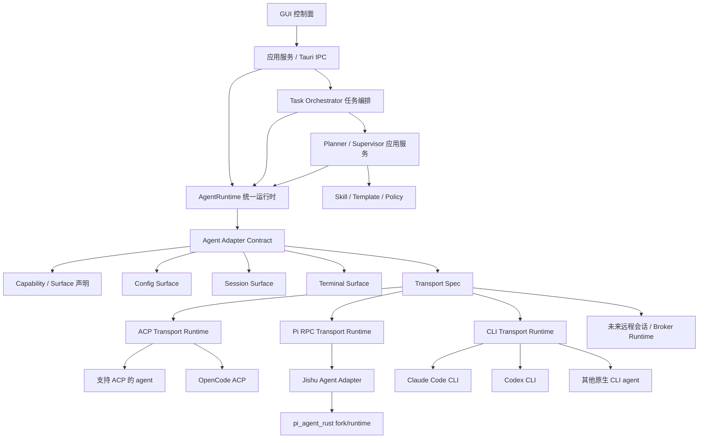

# Jishu Hub 开发指导文档

本文档是 `jishu-hub` 后续开发的最高层级工程指导。新的需求、重构、缺陷修复、架构升级都必须先对照本文档判断归属层级，再进入实现。若代码、历史文档、临时方案与本文档冲突，以本文档为准，并同步修正文档或提交架构变更说明。

当前版本方向：v0.6.x 是多智能体 GUI 控制系统和 Jishu Agent 能力的探索与重建阶段，不承担旧实验逻辑兼容包袱。发现结构不合理时，优先做正确架构，而不是保留临时路径。

## 1. 系统定位

`jishu-hub` 是一个多智能体 GUI 控制系统。它不是某个单一 agent 的外壳，也不是把所有 agent 包成同一个命令的脚本集合。

核心目标：

1. 通过 GUI 管理多个智能体的配置、会话、任务、运行状态、工具事件和人工审批。
2. 通过统一运行时对接多种 agent transport，其中 ACP 优先，CLI 作为 fallback 或原生交互入口。
3. 系统内置 `jishu agent`，它既是普通可对话 agent，也是任务规划、职责分配建议、过程监督、语义评估和返工建议的智能中枢；确定性调度、状态机和运行裁决归 Task Orchestrator。
4. 所有 agent 对 GUI 表现为统一能力模型，但每个 agent 的命令、配置、会话、事件格式由自己的 adapter 负责。

一句话架构：

```text
Jishu Hub = GUI 控制面 + Task Orchestrator + AgentRuntime + Agent Adapter Contract + 通用 ACP/Pi RPC/CLI Transport + Jishu Planner/Supervisor
```

## 2. 总体分层



分层职责：

| 层级 | 职责 | 禁止事项 |
| --- | --- | --- |
| GUI 控制面 | 渲染页面、交互、状态展示、人工审批输入 | 不拼 agent 命令，不解析 agent 私有配置/会话 |
| 应用服务 / IPC | 接收 GUI 请求，调用领域服务，做参数校验 | 不写 `activeId === "xxx"` 业务分支 |
| AgentRuntime | 通过 adapter surface 选择 transport，管理进程、会话、取消、事件流 | 不承载某个 agent 私有业务，不用 agent_id 分支选择 transport |
| Agent Adapter | 声明能力与 surface（含 TransportSurface），生成原生命令，解析私有配置/会话 | 不承载 GUI 页面逻辑，不做任务规划 |
| ACP Transport Runtime | 通用 ACP JSON-RPC 2.0 client，实现握手、session、prompt、update、resume、取消 | 不写成 `jishu-self` 专属逻辑 |
| Pi RPC Transport Runtime | Pi 原生 --mode rpc 协议适配器，处理 get_state/prompt/abort、AgentEvent 归一化 | 不写成 `jishu-self` 专属逻辑，未来其他 Pi-based agent 可复用 |
| CLI Transport Runtime | 执行原生 CLI 命令，读取 stdout/stderr/stdin，交给 adapter normalizer | 不把所有 agent 强制包进 Jishu 命令 |
| Jishu Planner/Supervisor | 生成任务图提案、角色与能力建议、应用 skill/template、语义评估和返工建议 | 不取代 agent adapter，不直接写任务状态，不持有确定性调度权 |
| Pi runtime fork | 提供 Jishu Agent 的底层 agent loop、工具、会话能力 | 不散落复制到 Hub 主代码 |

## 3. Transport 层设计

### 3.1 ACP 是一等通用 transport

ACP 必须在架构中独立存在。它不是 `jishu-self` 的私有实现，也不是适配某个 agent 的特例。

正确模型：

```text
Agent Adapter -> AcpCommandSpec -> AgentRuntime -> ACP Transport Runtime -> 目标 agent ACP server
```

约束：

1. `ACP Transport Runtime` 负责通用协议交互：`initialize`、`session/new`、`session/resume`、`session/load`、`session/prompt`、`session/update`、完成事件、错误事件、usage、取消和 session id 解析。
2. 每个支持 ACP 的 agent 只通过 adapter 声明 `TransportSurface::AcpPreferred`，并实现 `build_acp_command(ChatRequest) -> AcpCommandSpec`。
3. `AcpCommandSpec` 只描述要启动哪个 ACP server，包括 program、args、envs。它不应包含 GUI 业务，也不应包含 Jishu 任务编排语义。
4. OpenCode、claude_code、远程 ACP agent 都复用同一个 ACP runtime。claude_code 经 claude-agent-acp 桥走 ACP（探针门控见下）。
5. adapter 可覆写 `resolve_transport()` 声明探针门控的「有效 transport」。claude_code 声明 `AcpPreferred` 为目标，但仅在探针发现 `claude-agent-acp` 桥二进制时才升级，桥缺失则降级 `Cli`（行为与迁移前一致，零回归）。所有 dispatch 必须读 `resolve_transport()` 而非声明性的 `transport_surface()`。
6. ACP runtime 在 `initialize` 声明 `capabilities.elicitation.form=true`，并处理 `session/request_permission`（工具审批回填）与 unstable `elicitation/create`（claude_code 业务提问）。业务应答与审批分表（`pending_permissions` / `pending_elicitations`），按 JSON-RPC id 回写、互不串扰。
7. 任何新增 ACP agent 都不能复制其他 agent 的 ACP loop，也不能在页面或 IPC 中直接写 JSON-RPC 帧。
8. ACP 事件必须统一归一化成 `NormalizedEvent`，由 GUI 和 Task Orchestrator 共同消费。

### 3.2 Pi RPC 是独立 transport

Jishu Agent 底层 Pi 引擎不支持 ACP 协议，而是使用 Pi 原生 `--mode rpc` 协议（JSON-line，不同于 ACP 的 JSON-RPC 2.0）。

正确模型：

```text
Agent Adapter -> AcpCommandSpec -> AgentRuntime -> Pi RPC Transport Runtime -> Pi --mode rpc
```

约束：

1. `Pi RPC Transport Runtime`（`pi_rpc_runtime.rs`）负责 Pi 原生协议交互：`get_state`、`prompt`、`abort`、`AgentEvent` 流式事件归一化。
2. Jishu Agent adapter 声明 `TransportSurface::PiRpc`，通过 `build_acp_command` 生成启动命令（`pi --mode rpc`）。
3. `PiRpc` 与 `AcpPreferred` 是并列的 transport 选项，AgentRuntime 通过 adapter 的 `TransportSurface` 声明选择对应 runtime，禁止用 agent_id 硬编码判断。
4. 未来其他基于 Pi 的 agent 可复用同一个 Pi RPC runtime。
5. 所有 transport 的事件必须统一归一化成 `NormalizedEvent`。

### 3.3 Codex App Server 是独立 transport

Codex 不走 ACP，而是使用其原生 app-server 协议（newline-delimited JSON，但**省略 `jsonrpc:"2.0"` 字段**，不同于 ACP/Pi 的 JSON-RPC 2.0）。它与 ACP/PiRpc 并列，由 `TransportSurface::CodexAppServer` 标识。

正确模型：

```text
Agent Adapter -> AcpCommandSpec(codex app-server) -> AgentRuntime -> Codex App Server Runtime -> codex app-server
```

约束：

1. `Codex App Server Runtime`（`codex_app_server_runtime.rs`）负责 `initialize`（声明 `capabilities.experimentalApi=true`）、`thread/start`、`thread/resume`、`turn/start`、流式 notification、`turn/completed`、`turn/steer`、`turn/interrupt` 与 session/turn id 解析。
2. 工具审批走 `item/commandExecution/requestApproval`、`item/fileChange/requestApproval`、`item/permissions/requestApproval`，回写 `{decision:"accept"|"decline"}`。
3. 业务提问走 EXPERIMENTAL `item/tool/requestUserInput`，**最佳努力、不承诺跨版本稳定**：同一通道还承载 MCP/connector 副作用审批，runtime 必须按 payload 分流（origin `codex_tool_request_user_input` vs `codex_mcp_approval`），回写 `{answers:{[qid]:{answers:[value]}}}`。
4. codex adapter 声明 `TransportSurface::CodexAppServer`，GUI 流式走 app-server runtime；自治/阻塞路径仍走 CLI exec（`codex -p`）。
5. CodexAppServer 与 AcpPreferred/PiRpc 是并列 transport 选项，禁止用 agent_id 硬编码判断。

当前实现锚点：

- `src-tauri/src/agent_runtime.rs`：通过 adapter 的 `resolve_transport()` 选择 transport（ACP/PiRPC/CodexAppServer/CLI），GUI 流式与自治阻塞路径分派。
- `src-tauri/src/acp_runtime.rs`：通用 ACP JSON-RPC 2.0 client runtime（含 `request_permission` 审批回填与 `elicitation/create` 业务提问回填）。
- `src-tauri/src/pi_rpc_runtime.rs`：Pi 原生 RPC 协议 runtime。
- `src-tauri/src/codex_app_server_runtime.rs`：Codex app-server 协议 runtime。
- `src-tauri/src/agent/mod.rs`：`TransportSurface` 枚举（`AcpPreferred`、`PiRpc`、`CodexAppServer`、`Cli`、`Embedded`）。
- `src-tauri/src/agent/traits.rs`：`build_acp_command` 与 `resolve_transport`（探针门控，默认回退 `transport_surface`）adapter contract。
- `src-tauri/src/agent/jishu_self/mod.rs`：Jishu Agent adapter，声明 `PiRpc` transport。
- `src-tauri/src/agent/adapters/opencode.rs`：OpenCode ACP adapter 实例（`AcpPreferred`）。
- `src-tauri/src/agent/claude_code.rs`：Claude Code adapter，声明 `AcpPreferred` 目标 + `resolve_transport` 探针 `claude-agent-acp` 桥、缺失降级 `Cli`。
- `src-tauri/src/agent/adapters/codex.rs`：Codex adapter，声明 `CodexAppServer`。

## 4. CLI 架构：`jishu-cli` 与 `jishu` 的职责分离

系统中有两个独立的命令行程序，名称不同、来源不同、职责不同：

| 命令名 | 语言 | 安装方式 | 版本号来源 | 职责 |
|--------|------|---------|-----------|------|
| `jishu-cli` | Rust | 随 Jishu Hub 安装包捆绑，NSIS 自动放入 PATH | `CARGO_PKG_VERSION`（与 Jishu Hub 一致） | CLI 编排器：会话管理、agent 列表、doctor 诊断、终端交互入口 |
| `jishu` | Node.js | 用户在环境检测页手动点击安装（`npm install -g @jishu-hub/jishu-agent`） | `PI_AGENT_VERSION`（与上游 Pi 一致） | Pi Agent 运行时：实际执行 AI 对话、工具调用、MCP 扩展 |

### 4.1 为什么必须分开命名

早期二者共用 `jishu` 命名，导致以下严重问题：

1. **安装状态误判**：环境检测探测 `jishu` 命令时，找到了安装包捆绑的 Rust CLI 外壳，误报 Agent “已安装”。
2. **运行时崩溃**：GUI 对话时实际调用的是 Rust CLI（不支持 `--mode rpc`），导致 `unexpected argument '--mode'` 崩溃。
3. **版本号混乱**：Rust CLI 输出 `jishu 0.79.1-3`，UI 加前缀后显示为 `vjishu 0.79.1-3`。

### 4.2 运行时解析优先级

`pi_runtime.rs` 中 `resolve_pi_runtime()` 按以下顺序查找 Node.js Agent（注意：它查找的是 `jishu`，不是 `jishu-cli`）：

```text
1. JISHU_PI_BIN 环境变量      -> 开发/调试覆盖
2. ~/.jishu-agent/.../cli.js  -> 用户通过 UI 或安装器自动装入的版本
3. 安装目录/third_party/pi-bundle/.../cli.js -> 内嵌的 Node.js Agent（开箱即用兜底）
```


### 4.3 CLI transport 使用规则

CLI transport 用于两类场景：

1. agent 的有效 transport 降级到 CLI（例如 claude_code 在未安装 claude-agent-acp 桥时），或 agent 本身只有 CLI 交互面。Codex、Claude Code 的 GUI 流式现分别走 `CodexAppServer` 与 `AcpPreferred`（探针门控），CLI 仅作兜底。
2. 用户主动打开终端，使用该 agent 的正式命令进行交互或恢复会话。

原则：

- 用户可见命令必须是正式命令，例如 `jishu-cli chat start --agent jishu-self --project .`、`jishu-cli chat resume <session-id>`、`claude --resume`、`codex ...`。
- GUI 的“跳转控制台”只能调用 adapter 的 terminal surface，不允许页面拼接命令。
- 不允许把外部 agent 统一包装成 `jishu-cli agent-bridge`。当前正式路线已经移除临时 bridge/RPC 主路径。

## 5. Adapter 是硬边界

所有涉及智能体差异的逻辑必须由 adapter contract 或 adapter 之上的统一应用服务表达。

必须由 adapter 或 adapter surface 提供的能力（具体通过 `TerminalAdapter`、`TransportAdapter`、`ConfigAdapter`、`AgentManifest` 四大核心 Trait 承载）：

- agent 基础信息、健康检查、安装提示（含 `install_package_manager` 和 `auto_installed` 等标识）、应用可提供的更新版本（`available_version`）、动态 Logo 路径（`logo_path`）。
- transport 声明：ACP 优先、CLI、Embedded、未来 Remote。
- 配置 surface：raw、structured、model-store、unsupported。
- 项目设置 surface。
- 会话列表、会话恢复、消息解析、project path 编码转换。
- 终端启动/恢复命令。
- 流式事件归一化。
- 权限、工具、审批能力声明。

禁止：

- 禁止在 GUI、IPC、配置页、聊天页、任务页写 `activeId === "jishu-self"`、`agentId === "codex"` 这类业务分支。
- 如果现有 contract 无法表达差异，必须先扩展 capability 或 surface，再实现功能。
- 禁止为了快速修复把某个 agent 的配置解析、会话路径、终端命令写进页面组件。

例外处理：

- 调试脚本、迁移脚本可以短期识别具体 agent id，但不得进入生产运行路径。
- 若确实需要 agent id 参与数据迁移，必须在代码注释和文档中标明迁移范围、删除条件和目标 contract。正常功能实现不能以 agent id 分支作为方案。

## 6. Jishu Agent 的边界

`jishu-self` 是系统内置 agent，必须同时满足两种身份：

1. 普通 agent：可在智能体列表中选择，可聊天、可配置、可查看会话、可跳转终端。
2. 任务智能中枢：在任务维度负责规划、分解、选择 skill/template、提出角色与 agent 能力要求、监督执行、触发人工干预建议、判断返工和收敛。

边界：

- Jishu Agent 不是 Hub 的通用适配层。
- Jishu Agent 不负责替其他 agent 解析配置、生成终端命令、读取会话文件。
- Jishu Agent 的任务智能能力通过 Task Orchestrator 调用 Planner/Supervisor 使用；Jishu Agent 只返回结构化提案和评估结果，Task Orchestrator 负责校验、持久化、调度和状态转换。
- Jishu Agent 的底层 agent loop 当前复用 `pi_agent_rust` fork，但 GUI 和用户不应看到 Pi 身份。

当前 Jishu Agent runtime 约束：

- 使用 `pi_agent_rust` 作为 fork/runtime，后续通过 Git 同步上游。
- 由 `JishuSelfAgent` adapter 声明 `TransportSurface::PiRpc`，通过 Pi 原生 `--mode rpc` 协议交互（Pi 不支持 ACP 协议）。
- 通过 `PI_CODING_AGENT_DIR=~/.jishu-agent` 隔离 Jishu 自有 runtime 数据。
- 通过 identity prompt 明确对用户呈现为 `jishu agent`，不是 Pi。
- 会话保存走 Pi session 机制，Hub 保存 GUI session 与 native session 的映射。
- 不再使用临时 JSON-RPC/RPC bridge 作为 GUI 对话主路径。

## 7. Jishu Agent 的 MCP 扩展层

Jishu Agent 在 Pi 原生 RPC 协议之上扩展了 MCP（Model Context Protocol）工具发现与执行能力。该扩展由独立的 `pi-mcp-adapter` 包实现，不属于上游 Pi 核心；Hub 只负责配置同步与生命周期入口，协议层不参与。

### 7.1 路径隔离

通过 `PI_CODING_AGENT_DIR` 环境变量隔离 Jishu 自有 runtime：

- 上游 Pi 默认：`~/.pi/agent`
- Jishu Agent 覆盖：`~/.jishu-agent`

派生路径：

- MCP 服务器配置：`<PI_CODING_AGENT_DIR>/mcp.json`
- Adapter npm 包：`<PI_CODING_AGENT_DIR>/npm/node_modules/pi-mcp-adapter`

fork 重命名时需保持 `configDir` 与 `PI_CODING_AGENT_DIR` 对齐。

### 7.2 配置 schema 与读取

`mcp.json` 形如：

```json
{
  "mcpServers": {
    "<name>": {
      "url": "https://example.com/mcp",
      "headers": { "Authorization": "Bearer ${MCP_TOKEN}" },
      "transport": "streamable-http"
    }
  }
}
```

字段名是 `headers`（不是 `http_headers`），并支持 `${ENV_VAR}` / `$env:ENV_VAR` 插值。

Jishu Hub 在用户保存配置时把 `settings.json` 的 `mcpServers` 镜像到 `mcp.json`，adapter 始终读到最新配置。Adapter 启动后只读 `mcp.json`，不直接读 Hub 的 `settings.json`。

### 7.3 Adapter Contract

Hub 与 MCP 子系统的交互必须通过 `ConfigAdapter` trait，禁止在页面或 IPC 中写 `agent_id` 分支：

- `supports_mcp()` — 能力声明
- `check_mcp()` — 返回 `{ installed, version }`
- `install_mcp()` — 异步安装
- `update_mcp()` — 使用 adapter 原生包管理能力更新已安装的 MCP 适配器
- `migrate_mcp_if_needed()` — 幂等地把 `mcpServers` 从 `settings.json` 同步到 `mcp.json`

`AgentStatus` 暴露 `mcp_installed` / `mcp_version` 字段，`list_agent_statuses()` 自动为声明 `supports_mcp = true` 的 adapter 调用 `check_mcp()`，GUI 从单一数据源渲染状态徽章。

同样的 adapter-contract 形态用于检测 claude_code 的外部 **transport-bridge 依赖**（`claude-agent-acp`）。该桥是未捆绑的 npm 包，claude_code 仅在其存在时才升级到 `AcpPreferred`（探针门控见 §3.1），缺失则降级 `Cli`。检测/安装走平行的 trait 方法，禁止在页面或 IPC 写 `agent_id` 分支：

- `supports_transport_bridge()` — 能力声明
- `check_transport_bridge()` — 返回 `{ installed, version, name }`（复用 `resolve_transport()` 的同一探针）
- `install_transport_bridge()` — 异步安装（`npm i -g @agentclientprotocol/claude-agent-acp`）

`AgentStatus.transport_bridge`（`TransportBridgeStatus`）由 `list_agent_statuses()` 对声明 `supports_transport_bridge = true` 的 adapter 回填；env-check 页据此在 agent 行下渲染桥子项（与 MCP 适配器子项并列），缺失可一键安装。

### 7.4 生命周期模式

`pi-mcp-adapter` 支持三种服务器生命周期（默认 `lazy`）：

- `lazy` — 首次工具调用时连接
- `keep-alive` — 启动时连接并跨会话保持
- `eager` — 每个会话启动都重连

## 8. 配置系统

配置页必须由 adapter 的 `ConfigSurface` 驱动。

推荐 surface：

- `Raw { format }`：适合纯文本原生配置文件（例如没有强类型支持或纯文本手写的 agent）。
- `Structured { schema_id }`：适合 Claude/OpenCode/Codex 等可结构化编辑的 agent。
- `ModelStore { provider, supports_picker }`：适合 Jishu/Pi 模型库。前端必须严格依赖 `supports_picker` 来决定是否渲染模型选择器，绝对禁止前端写 `activeId === "pi"` 这类的嗅探逻辑。
- `Unsupported { reason }`：明确不可配置。

规则：

1. 配置加载、保存、校验都要通过后端 adapter/配置服务。
2. 前端只根据 surface 渲染对应编辑器。
3. 新增 agent 配置时，先定义 schema 或 model-store contract，再接页面。
4. 配置错误要返回结构化错误，页面只负责展示，不解析 agent 私有文件。

## 9. 会话系统

会话是 agent 私有数据，Hub 只持有统一索引和展示模型。

规则：

- adapter 负责真实 session id、文件路径、project path 编码、消息结构解析。
- AgentRuntime 负责 GUI 临时 session id 与 native session id 的解析、过滤和替换。
- `pending-*`、`new_session_*` 这类 GUI 临时 id 不能传给 native agent resume。
- ACP agent 应通过 `session/resume` 或 `session/load` 恢复 native session。
- CLI agent 应通过 adapter 生成原生命令恢复。
- 消息展示统一转换到 Hub 的 message/content block 模型。

Jishu/Pi 会话特别约束：

- Pi 的项目路径编码必须使用 Pi 兼容规则。
- `jishu-self` 恢复会话时要找到 native Pi session，而不是拿 GUI 临时 id 恢复。
- 对话历史保存失败时，优先检查 ACP session result、Pi session root、native session id 映射。

## 10. 统一任务图、规划与 skill/template

任务能力是 v0.6.x 的核心，不是临时功能。任务系统的权威模型是统一任务图，不再以可变 `plan document` 或线性 `step[]` 作为最终领域真相。

### 10.1 权威对象

任务系统必须区分以下对象：

- `TaskGraph`：长期任务身份，保存目标、项目根目录和当前草稿版本。
- `GraphRevision`：经过完整校验的不可变任务图快照，包含节点、依赖、策略、角色要求以及规划输入。
- `GraphRun`：绑定某个 Revision 的一次执行。
- `NodeRun / NodeAttempt`：节点在一次 Run 中的逻辑状态与实际执行尝试。
- `TaskEvent`：Task Orchestrator 产生的追加式运行事实。
- `Projection`：工作台画布、列表、时间线、审批队列和统计等可重建视图。

约束：

1. `GraphRevision` 不等于 `GraphRun`，运行状态不得回写并污染计划快照。
2. 图编辑必须创建新 Revision，不得原地覆盖已执行版本。
3. 列表、甘特图、时间线和画布不得各自维护独立任务模型。
4. 纯视觉坐标、缩放、折叠和视口属于 Workbench Layout，不进入 Revision；改变阶段归属、依赖、优先级或策略的操作必须转换为明确的领域命令。
5. 运行事实来自 `TaskEvent`，GUI 不得通过轮询结果和临时事件自行拼装另一套权威状态。

### 10.2 任务生命周期

1. 用户输入目标、项目、约束、预算、权限偏好，并可选择 skill/template。
2. Task Orchestrator 通过 Planner/Supervisor 应用服务准备规划输入，并经 AgentRuntime 调用 Jishu Agent，传入可用 agent capability、项目上下文和允许使用的规划输入。
3. Jishu Planner 返回结构化 `GraphProposal`，包括 GraphCommand、角色与能力要求、验收条件、理由和风险；Planner 不直接写数据库或启动节点。
4. Task Orchestrator 校验提案的 schema、DAG、权限、预算、资源声明和输入输出契约，生成候选 GraphRevision。
5. GUI 在任务主工作台展示任务图和 Revision Diff，支持手工修改、补充约束、接受部分提案、重新规划和最终确认。
6. 用户与 AI 的编辑都使用同一 GraphCommand 协议；后端校验通过后原子创建不可变 Revision。
7. Task Orchestrator 启动 GraphRun，按依赖、资源、权限、预算和审批约束进行最大安全并行调度。
8. 可执行节点通过 AgentRuntime 派发。AgentRuntime 根据 Adapter 的 `resolve_transport()` 选择 ACP、PiRpc、CodexAppServer、CLI 或 Embedded Runtime，并统一输出 `NormalizedEvent`。
9. Task Orchestrator 将与 Run/Attempt 可靠关联的 `NormalizedEvent` 转为 `TaskEvent`，再更新任务投影；GUI 只消费投影和结构化审批请求。
10. Jishu Supervisor 在需要语义判断时评估进展、产物和目标，返回 `EvaluationResult` 或 `RecoveryProposal`。确定性重试、Lease、超时和状态转换仍由 Task Orchestrator 处理。
11. 返工、Repair Subgraph、持久化 Loop 或运行中改图必须形成结构化提案，经 Task Orchestrator 校验后创建或应用新 Revision。
12. Run 完成后保存最终验收、Artifact、usage、审批、实际 agent 绑定和事件轨迹，用于复盘与后续 evaluation/policy。

### 10.3 Planner/Supervisor 与 Task Orchestrator 边界

Jishu Planner/Supervisor 提供智能判断，Task Orchestrator 提供确定性控制。

Jishu Planner/Supervisor 负责：

- 将目标和约束转为 GraphProposal。
- 建议阶段、节点、依赖、角色、能力要求和验收条件。
- 应用 skill/template 方法论。
- 评估执行是否取得语义进展。
- 提出返工、Repair、Loop、继续、停止或人工介入建议。

Jishu Planner/Supervisor 禁止：

- 直接修改 TaskStore、GraphRun 或 NodeRun。
- 直接发放 Lease、选择 Transport 或控制进程。
- 绕过 Revision、权限、预算、审批或状态机校验。
- 通过 agent id 硬编码任务行为。
- 替代 Agent Adapter 解析其他 agent 的私有协议、配置或会话。

Task Orchestrator 负责：

- GraphCommand、GraphRevision 和领域校验。
- 依赖释放、资源仲裁、Lease、取消、超时和最大安全并行。
- 权限策略、人工审批、预算和幂等约束。
- TaskEvent、状态机、崩溃恢复和投影。
- 对 Planner/Supervisor 提案做最终裁决并形成可审计事实。

### 10.4 skill/template/policy 契约

`superpowers`、`gstack` 和其他 task template 都属于声明式规划与执行输入，不是 Agent Adapter，也不能只作为 UI 标签。

每个 skill/template 至少定义：

```text
id
version_or_content_hash
inputs_schema
applicable_when
planning_rules
execution_constraints
expected_graph_shape
evaluation_rules
```

规则：

1. 选中的 skill/template/policy 及其版本、内容 hash 和输入必须写入 GraphRevision。
2. GraphRun 必须记录实际解析到的版本、有效输入和运行期 policy 快照，不能只引用一个可能变化的本地名称。
3. skill/template 可以影响图结构、节点策略、审批点、Loop、评估器和恢复策略，但不能隐式修改 Adapter 行为。
4. skill/template 不得自行持有 Agent ID 特例；只能声明角色、所需 capability、偏好和约束。
5. 新增 skill/template 前必须定义适用场景、输入、预期图结构、执行约束、验收规则和失败行为。
6. 删除或升级 skill/template 后，历史 Revision 和 Run 仍必须能解释其当时使用的版本或内容 hash。
7. 敏感输入只能保存 SecretRef 或脱敏摘要，不得把 token、密码或私钥写入 GraphRevision、TaskEvent 或 Planner prompt trace。

### 10.5 角色与 agent 分配

- GraphRevision 保存 `RoleRequirement` 和 capability 要求，不保存由页面猜测的 Transport。
- 用户可以明确锁定某个 agent，但该锁定是结构化的 `AgentAssignmentConstraint`，不是业务代码中的 agent id 分支。
- GraphRun 保存实际 `AgentAssignment`、Adapter capability 快照和 native session 映射。
- Task Orchestrator 根据用户约束、Adapter capability、Agent 健康状态、并发额度和资源策略解析实际绑定。
- AgentRuntime 只根据 Adapter surface 启动对应 Transport Runtime，不解释任务角色。

### 10.6 Loop、返工与运行中修改

- Agent 内部模型/工具循环属于单次 NodeAttempt，由目标 agent 的原生 loop 和 Transport Runtime 承载。
- 跨 Attempt、可休眠、可重启恢复的循环必须建模为任务图中的持久化 Loop Controller。
- Loop 必须有退出条件，并至少配置次数、时间、Token 或成本中的一种硬预算。
- 返工和 Repair 必须生成受限子图或 Revision Proposal，不允许静默覆盖失败节点的历史。
- 运行中只允许修改未启动子图；已租赁、运行中、等待审批和已完成节点保持冻结。
- Revision 切换只能由 Task Orchestrator 在安全点应用，并写入 TaskEvent。

### 10.7 可测试性

不同 skill/template 和 Planner/Supervisor 策略必须可通过固定输入验证：

- 是否生成符合约束的 GraphRevision。
- 是否体现声明的方法论、阶段和验收点。
- 是否只使用满足 capability 的角色要求。
- 是否生成正确的审批、预算、Loop 和恢复策略。
- 相同输入、固定模型响应或 Golden Proposal 下是否得到确定性校验结果。
- TaskEvent 重放后是否得到一致投影。
- Planner/Supervisor 返回非法、越权或超预算提案时，Task Orchestrator 是否拒绝且不改变运行事实。

## 11. 权限与人工干预

权限不是 adapter 私有判断，也不是 GUI 文案。

目标层次：

- Adapter 声明 agent 支持哪些权限能力和工具事件。
- AgentRuntime/Transport Runtime 捕获工具调用、文件写入、命令执行、网络访问等事件。
- Permission Policy 判断是否允许、拒绝、请求人工确认。
- GUI 只展示审批请求并把用户决策回传。
- Task Orchestrator 根据审批结果继续、暂停、返工或失败。

ACP 场景下，审批应优先通过 ACP 的 tool/update/approval 能力表达。若某个 agent 暂不支持执行前拦截，必须在能力声明中体现，不能假装已经完整支持。

## 12. 版本与验证纪律

每次交付给用户测试前都要递增版本号，便于用户确认是否安装了最新构建。`v0.7.2` 已正式发布；下一轮开发的测试版从 `0.7.3` 起递增。

修改范围涉及 agent、adapter、ACP、任务编排、配置页时，至少执行：

```powershell
cargo fmt --manifest-path src-tauri\Cargo.toml
cargo check --manifest-path src-tauri\Cargo.toml
cargo test --manifest-path src-tauri\Cargo.toml runtime_transport_uses_adapter_contract_not_bridge_wrapping
cargo test --manifest-path src-tauri\Cargo.toml registry_exposes_adapter_surfaces_without_agent_id_branching
cargo test --manifest-path src-tauri\Cargo.toml jishu_interactive_invocation_uses_pi_without_bridge_or_json_mode
```

若改动 `third_party/pi_agent_rust` 的 ACP/session/model/tools：

```powershell
cargo fmt --manifest-path third_party\pi_agent_rust\Cargo.toml
cargo test --manifest-path third_party\pi_agent_rust\Cargo.toml acp --lib
```

用户主要做 GUI 功能验证，开发者负责打包、基础命令检查、Rust/前端构建检查和测试文档。

## 13. 文档维护规则

以下场景必须更新本文档：

1. 新增或调整 AgentRuntime、adapter contract、transport surface。
2. 新增 agent 接入方式，例如远程 ACP、WebSocket broker、云端 agent、daemon。
3. 新增大的任务编排能力，例如 Harmes 自学习架构、远程调度会话能力、跨机器执行。
4. 新增影响权限、审批、工具调用、模型路由、session broker 的能力。
5. 推翻某个临时实现或移除历史设计。
6. 前端文案变动时：所有涉及用户感知的文案与状态文本，禁止包含具体引擎的代号（如 Pi、jishu-self 等），必须全部接入 i18n 系统并使用统一泛化名词。

每次 v0.6.x 交付还应在 `docs/v0.6.0/final-goal/codex` 下补充：

- 完成报告。
- GUI 测试步骤。
- 架构差异或问题闭环说明。
- 可能问题和后续风险。

## 14. 后续大版本预留

### Harmes 自学习架构

Harmes 或类似自学习能力应作为学习/evaluation/policy 层接入，不应塞入任意 agent adapter。

原则：

- 学习输入来自 GraphRevision、TaskEvent、Artifact、EvaluationResult、usage、审批结果和人工反馈。
- 学习输出只能通过 policy、prompt pack、skill、planner hint、evaluation rule 影响任务。
- 不允许隐式修改 agent adapter 行为。
- 所有自学习影响必须可追踪、可回滚、可解释。

### 远程调度会话能力

远程调度应作为 Remote Runtime 或 Session Broker 层，不由某个 agent adapter 私自实现。

原则：

- 远程 agent 仍通过 adapter contract 声明能力。
- 远程调用仍输出 `NormalizedEvent`。
- 远程会话 id、权限、取消、恢复、日志必须有统一 broker contract。
- GUI 不关心本地进程、远程进程、云端任务的差异。

### 多协议扩展

未来可以支持更多 transport，但新增前必须回答：

1. 它与 ACP/CLI 的关系是什么。
2. 是否需要新的 `TransportSurface`。
3. 事件如何归一化。
4. 会话如何恢复。
5. 权限如何拦截。
6. GUI 是否无需新增 agent id 分支。

## 15. 开发决策清单

实现任何 agent 相关需求前，先回答：

1. 这是 GUI 展示问题、应用服务问题、AgentRuntime 问题、adapter 问题、transport 问题，还是 Task Orchestrator 问题。
2. 是否需要新 surface/capability，而不是写 agent id 分支。
3. 需要哪种 transport（ACP、PiRPC、CLI），是否复用已有 runtime。
4. 是否影响配置页、会话页、终端跳转、任务执行四条路径。
5. 是否影响 Jishu Agent 的普通 agent 身份或任务中枢身份。
6. 是否需要更新 `DEVELOP_READ.MD` 和 codex 完成报告。
7. 是否需要给用户递增版本号并说明测试步骤。

实现任务编排相关需求还必须回答：

1. 这是 TaskGraph/Revision、GraphRun、TaskEvent、Projection、Planner/Supervisor，还是 AgentRuntime 的职责。
2. 变更是否通过 GraphCommand 和不可变 Revision 表达，纯布局状态是否与任务语义分离。
3. Planner/Supervisor 返回的是提案还是在越权修改确定性状态。
4. skill/template/policy 的版本、输入和效果是否进入 Revision、Run 事实与测试。
5. Agent 选择是否基于 capability 和结构化约束，而不是 agent id 业务分支。
6. `NormalizedEvent -> TaskEvent` 的关联、幂等、重放和丢失恢复是否明确。
7. 是否影响权限、审批、预算、Loop、崩溃恢复或运行中 Revision 切换。

## 16. 当前优先修复方向

当前架构基准已经明确：

1. Transport 层已拆分为 ACP、Pi RPC、CLI 三种独立 runtime，通过 adapter 的 `TransportSurface` 声明选择，禁止 agent_id 硬编码分支。
2. Jishu Agent 声明 `PiRpc` transport，通过 Pi 原生 `--mode rpc` 协议对接 `pi_agent_rust`（Pi 不支持 ACP）。
3. GUI chat、task dispatch、CLI send 都应通过 AgentRuntime 选择 transport。
4. 配置页、会话页、终端跳转必须通过 adapter surface。
5. 临时 RPC/bridge 主路径已经不再作为正式方向。
6. 后续若发现旧代码仍绕过 adapter contract，应直接按本文档重构，不为兼容旧实验路径让步。

## 17. 跨平台操作系统适配架构设计 (OS Adapter Architecture)

由于 Jishu Hub 涉及底层环境操作、依赖安装、独立 CLI 分发及控制台调用，强行在业务层使用条件编译宏（如 `#[cfg(target_os = "windows")]`）会导致代码严重碎片化。必须引入统一的 **OS Adapter 抽象层**（建议剥离至 `src-tauri/src/os_adapter/` 模块），用来隔离操作系统的底层命令差异，并对无 Mac 测试环境提供充分的安全容错保障。

### 17.1 底层命令与 Shell 执行封装 (Command Execution)

所有涉及外部命令调用的地方，禁止在业务逻辑中直接写死 `Command::new("powershell")` 或 `Command::new("cmd")`。

**设计准则：**
- 抽象统一的 `ShellExecutor` Trait，提供跨平台的命令执行入口。
- **Windows 实现**：常规命令使用 `cmd /c` 代理；安装或复杂脚本交互统一使用 `powershell -NoProfile -NonInteractive -Command` 封装保障路径。
- **macOS/Unix 实现**：常规命令使用 `sh -c` 代理；依赖安装根据上下文直接调用系统级包管理器（如 `brew` 或直接调用二进制）。
- 兜底保障：遇到失败必须捕获完整的 stdout/stderr 以结构化 Error 的形式返回到上层，而不是让进程直接 panic。

### 17.2 环境检测与一键安装能力下推 (Environment & Installation)

当前环境检测逻辑和一键安装命令（如 Git 的安装）严重依赖 Windows 特性（如 `winget`、`choco`）。应将该逻辑抽象为基于 OS 策略的适配器，同时保持前端的纯粹性。

**设计准则：**
- **包管理器抽象 (PackageManager Adapter)**：
  - 定义 `PackageManager` 统一接口：`install(package)`, `upgrade(package)`, `check_installed(package)`。
  - Windows 端实现 `WingetAdapter`、`ChocoAdapter`。
  - macOS 端强制映射系统级依赖为 `BrewAdapter`，将前端意图转义为对应的 `brew install <pkg>` 逻辑。
- **动态控制面下发**：
  - 后端的 `check_environment` 接口，应承担起识别当前 OS 的职责，动态构造对应平台的操作配置（比如将 `download_url` 分为 `/win` 或 `/mac` 发给前端）。
  - 前端页面（如 `env-check-page.tsx`）只做无状态的视图渲染层，**坚决禁止在前端包含硬编码的系统平台链接嗅探或命令嗅探**。

### 17.3 独立 CLI 的系统级软链接注入 (CLI Path Registration)

在 Windows 平台，CLI 的 `PATH` 变量注入可以通过打包工具的安装向导 (`installer.nsh`) 自动完成（安装 `jishu-cli.exe` 到 `$INSTDIR` 并加入 PATH）。但在 macOS 的 `.app` 拖拽安装模式下，不存在这个步骤，必须实现“应用内按需授权安装”。

**设计准则：**
- **手动按需激活模式**：在前端设置页或环境检测页提供一个 `[安装 jishu-cli 命令行工具至 PATH]` 的用户引导交互。
- **macOS/Unix 适配策略**：后台提供 IPC 方法 `os_adapter::install_cli_symlink()`，利用 Rust 原生 API `std::os::unix::fs::symlink`，在 `/usr/local/bin/jishu-cli` 建立软链接，源路径指向 macOS 规范中内部的 `Contents/MacOS/jishu-cli` 二进制文件。
- **状态探测回环**：后端需侦测系统 `PATH` 或该路径下的文件指针链接，向前端回传当前系统的 CLI 正确安装状态以渲染状态徽章。

### 17.4 跳转控制台与终端沙箱隔离 (Terminal Jump)

业务中“打开系统原生终端工具（Terminal Surface）”对于两种系统行为差异极大。

**设计准则：**
- 定义跨平台动作：`open_system_terminal(cwd: &Path, command: Option<&str>)`
- **Windows 实现**：调用 `cmd.exe /K "cd /d {cwd} && {command}"` 或者是 `powershell.exe -NoExit -Command "Set-Location '{cwd}'; {command}"`。
- **macOS 实现**：通过系统命令 `open -a Terminal {cwd}` 唤起原生终端，如果需要注入前置命令，则应生成 AppleScript 语句（利用 `osascript` 临时执行注入键盘按键），从而规避繁杂的沙箱限制。

### 17.5 盲端跨平台开发安全准则 (No-Mac Blind Test Protocols)

为了在只有 Windows 实机的情况下，保证 macOS 平台代码不会发生致命崩溃：
1. **沙箱与容错原则**：所有 macOS 下调用的 Shell 命令或路径操作，必须有 `Err()` 的兜底匹配。比如在遇到没有安装 Homebrew 时，`brew install` 执行会失败，不可令线程直接崩溃，须结构化地将无环境警告透传到前端界面。
2. **拒绝字符串拼装路径**：跨平台文件路径全程必须使用 `std::path::PathBuf` 和 `.join()` 进行构建，严格禁止在代码中拼凑使用硬编码的 `/` 或反斜杠 `\`。
3. **原生抽象优先**：只要需求能够通过 Rust 标准库解决（例如创建目录 `std::fs::create_dir_all`、跨系统读取环境变量 `std::env::var`），坚决不能为了图省事而借助 `shell_command` 调用 OS 底层指令（如执行系统级 `mkdir` 或 `echo`），从而最大化抹平平台的命令语义差异。
