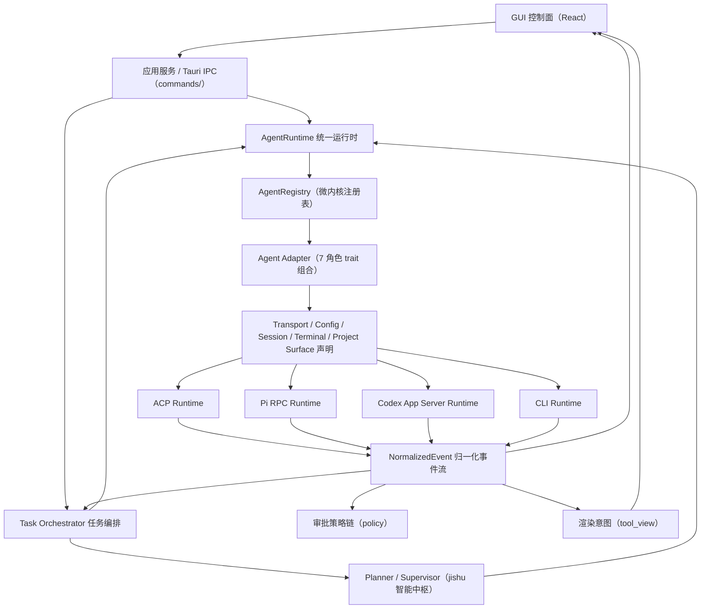

# Jishu Hub 开发指导文档（DEVELOP_READ）

本文档是 `jishu-hub` 开发的**最高层级工程指导**：只描述宏观架构（分层、核心机制、硬约束纪律）。新需求、重构、缺陷修复、架构升级前必须先对照本文档判断归属层级；当代码、历史文档、临时方案与本文档冲突时，以本文档为准，并同步修正文档或提交架构变更说明。

## 1. 本文档的定位与维护原则（必读）

**本文档只写宏观，不罗列功能点。** 收录标准只有三类：

1. **分层与职责**：系统怎么分层，每层的职责与禁止事项。
2. **核心抽象与机制**：跨版本稳定存在的架构机制（微内核注册表、归一化事件、能力协商、审批策略链等）的语义与纪律。
3. **硬约束纪律**：不分版本一律生效的开发纪律（硬边界、数据持久化、文件规模、验证纪律）。

**不收录**（写了就是违反本原则）：

- 功能点的实施细节、需求裁决过程、版本级实施记录 → `docs/vX.Y.Z/` 版本文档（规划见 `docs/版本规划指南.md`）。
- 暂缓/调研/待重启事项 → `docs/遗留需求/`（**版本固定后**才归档，开发期内不入）。
- `third_party/pi` fork 的改动 → `PI_CHANGE.MD`（修改 pi 前必读）。
- file:line 级实现细节 → 代码注释。

**修改时机**：仅当发生架构层级变化（新增层 / 新 transport / 新横切机制 / 硬约束变更 / 分层调整）时修改对应章节；**加功能不改本文档**。本文档章节号被代码注释与版本文档引用，重构章节时必须同步全部引用点。

## 2. 系统定位

`jishu-hub` 是一个多智能体 GUI 控制系统：不是某个 agent 的外壳，也不是把所有 agent 包成同一个命令的脚本集合。

1. 通过 GUI 管理多个智能体的配置、会话、任务、运行状态、工具事件与人工审批。
2. 通过统一运行时对接多种 agent transport（ACP / Pi RPC / Codex App Server / CLI），微内核注册表 + adapter contract 吸收各方言差异。
3. 内置 `jishu agent`：既是普通可对话 agent，也是任务规划、监督、评估的智能中枢；确定性调度与运行裁决归 Task Orchestrator。
4. 所有 agent 对 GUI 表现为统一能力模型（能力协商驱动 UI），每个 agent 的命令、配置、会话、事件归一化由自己的 adapter 负责。

一句话架构：

```text
Jishu Hub = GUI 控制面 + Task Orchestrator + AgentRuntime + 微内核（AgentRegistry + Agent Adapter Contract）+ 通用 Transport Runtime（ACP/Pi RPC/Codex App Server/CLI）+ Jishu Planner/Supervisor
```

## 3. 总体分层



| 层级 | 职责 | 禁止事项 |
| --- | --- | --- |
| GUI 控制面 | 渲染、交互、状态展示、审批输入 | 不拼 agent 命令，不解析 agent 私有配置/会话，不写 agentId 业务分支 |
| 应用服务 / IPC | 接收 GUI 请求，调领域服务，参数校验 | 不写 `activeId === "xxx"` 业务分支 |
| AgentRuntime | 按 adapter surface 选择 transport，管理进程、会话、取消、事件流 | 不承载 agent 私有业务，不用 agent_id 分支选 transport |
| Agent Adapter | 声明能力与 surface，生成原生命令，解析私有配置/会话，事件归一化 | 不承载 GUI 页面逻辑，不做任务规划 |
| Transport Runtime | 通用协议 client（握手、会话、prompt、事件流、取消） | 不写成某个 agent 的专属逻辑，禁止复制既有 loop |
| 微内核横切层（tool_view / policy） | 渲染意图单一分类；审批决策链 | 不含 per-agent 特例分支 |
| Jishu Planner/Supervisor | 任务图提案、角色建议、语义评估、返工建议 | 不直接写任务状态，不持确定性调度权 |
| Task Orchestrator | 图校验、调度、审批、预算、状态机、投影 | 不做语义判断（交 Planner/Supervisor 提案） |

## 4. 微内核核心机制

Rust 层是微内核形态，四个核心抽象：

1. **AgentPlugin trait 组合**（`agent/traits.rs`）：`AgentManifest + TransportAdapter + ConfigAdapter + SessionAdapter + TerminalAdapter + ProjectAdapter + EventNormalizer`。接入一个新 agent = 实现这组 trait 并注册进 **AgentRegistry**（`agent/mod.rs`），共享层对 agent 的感知只经 registry 查询。「写一份 TOML 就接入标准 CLI agent」的声明式 manifest 留后续（见 `docs/遗留需求/`）。
2. **NormalizedEvent**（`agent/normalized.rs`）：所有 transport 事件的**唯一归一化目标**，GUI 与 Task Orchestrator 共同消费同一事件流。事件结构变更必须 wire 兼容（新增字段可缺省，禁止改语义）。
3. **CapabilitySet 位标志 + Surface 可辨识联合**：agent 支持什么由声明驱动（能力位如 APPROVAL_REQUEST、TASK_MODE；ConfigSurface 如 Raw/Structured/ModelStore/Unsupported；TransportSurface 如 AcpPreferred/PiRpc/CodexAppServer/Cli）。前端按声明渲染，**声明即出现、未声明即隐藏**，未来 agent 支持某能力时零前端改动。
4. **能力诚实原则**：未支持就声明不支持，禁止假装支持（虚假能力位 = 架构事故）。

配置系统纪律：配置页由 `ConfigSurface` 驱动，前端只按 surface 渲染编辑器，加载/保存/校验全走后端 adapter；跨端序列化字段一律 snake_case（新字段禁止 camelCase）。

## 5. Transport 运行时

四种并列 transport，由 adapter 的 `TransportSurface` 声明、dispatch 读 `resolve_transport()`（探针门控，如 claude_code 仅有 ACP 桥时才升级）选择：

| Transport | 协议形态 | Runtime | 接入 agent |
| --- | --- | --- | --- |
| ACP | JSON-RPC 2.0 | `acp_runtime/` | opencode、claude_code（经 claude-agent-acp 桥，探针门控） |
| Pi RPC | JSON-line（`--mode rpc`） | `pi_rpc_runtime.rs` | jishu-self（未来其他 Pi-based agent 可复用） |
| Codex App Server | NDJSON（省略 jsonrpc 字段） | `codex_app_server_runtime.rs` | codex |
| CLI | 原生命令行 | CLI exec 路径 | 降级兜底与终端交互入口 |

共同纪律：

1. 启动命令经 `AcpCommandSpec`（只描述 program/args/envs，不含业务与编排语义）。
2. 每种协议一份通用 runtime；新增 ACP/codex/Pi agent **禁止复制**已有 loop、禁止在页面或 IPC 直接写协议帧。
3. 一切事件必须归一化为 `NormalizedEvent` 后出 runtime。
4. CLI 双命名不得混用：`jishu-cli`（Rust，随 Hub 捆绑的 CLI 编排器）与 `jishu`（Node.js，Pi agent 运行时）职责不同；用户可见命令必须是正式命令，「跳转控制台」只走 adapter 的 terminal surface。
5. 新增 transport 前必须回答：与现有 transport 的关系、是否新 TransportSurface、事件如何归一化、会话如何恢复、权限如何拦截、GUI 是否零 agentId 分支。

## 6. 渲染意图与审批策略链（两个横切层）

**渲染意图（`agent/tool_view.rs`）**：工具视图分类的**单一权威源**——分类与位置提取一次完成，`view` 随 `ToolUseStart` 事件与持久化 `ContentBlock::ToolUse` 块携带，直播与回放同源渲染，UI 只做「意图→组件」纯映射。新增工具分类只改 Rust；前端 `classifyToolName` 仅为 v1 之前历史数据的回退。

**审批策略链（`agent/policy.rs`）**：所有「这个动作允许吗？」决策统一为可组合 waterfall 链——策略拥有决策就短路 Allow/Deny，否则 Delegate（弹 UI / 无头拒绝）。挂载点：ACP `session/request_permission`、codex `requestApproval`、Pi 审批型 extension confirm 到达时先过链；无头任务链含 `HeadlessDenyPolicy` 自动拒绝；orchestrator 档位门控同链组装。「始终允许」等记忆回写必须与链评估同形状（到达时登记原始上下文，resolve 时取回）。会话工具模式（完全访问/变更前审批/智能审批/只读）只是不同链装配，不改决策机制。审批类型（命令执行/文件写入/其他）按动作真实分类，不恒为 Other。

## 7. 硬边界规则

**Agent 差异逻辑必须由 adapter contract 或 adapter 之上的统一服务表达**：

- 禁止在 GUI、IPC、配置页、聊天页、任务页写 `agentId === "xxx"` 业务分支。
- contract 表达不了差异时，先扩展 capability/surface，再实现功能；禁止为快速修复把某 agent 的配置解析、会话路径、终端命令写进页面组件。
- GUI 纪律：文案与状态文本全部走 i18n，**禁止暴露内部引擎代号**（Pi、jishu-self 等对用户不可见，用统一泛化名词）。
- 例外：调试/迁移脚本可短期识别具体 agent id，但不得进入生产路径，须注释迁移范围与删除条件。

## 8. 内置 Jishu Agent

双重身份：普通可对话 agent + 任务智能中枢（提案、评估、建议）。边界：

- 不是 Hub 的通用适配层，不替其他 agent 解析配置、生成命令、读会话。
- 只返回结构化提案与评估结果；校验、持久化、调度、状态转换归 Task Orchestrator。

运行形态：底层复用 `third_party/pi` fork（`--mode rpc` 协议，GUI 与用户不感知 Pi 身份）；`PI_CODING_AGENT_DIR=~/.jishu-agent` 隔离自有 runtime 数据（路径派生见 `agent/jishu_self/paths.rs`）；会话走 Pi session 机制，Hub 维护 GUI/native 映射。**改动 pi fork 前必读 `PI_CHANGE.MD`，任何改动如实详细记录。**

MCP 扩展：由独立 `pi-mcp-adapter` 包实现（不在 Pi 核心，Hub 协议层不参与）；Hub 只做配置同步与生命周期入口（`supports/check/install/update/migrate` trait 方法），同样禁止 agent_id 分支。

## 9. 会话系统与数据持久化原则

会话是 agent 私有数据，Hub 只持统一索引与展示模型：

- adapter 负责真实 session id、文件路径、project path 编码、消息结构解析；GUI 临时 id（`pending-*`、`new_session_*`）不得传给 native resume。
- 消息展示统一转换到 Hub 的 message/content block 模型。

**数据持久化原则**：记录类、统计类、审计类数据（用量记账、压缩记录、审批记忆持久化等）**优先落 SQLite**（`~/.jishu-hub/` 下独立 db，如 `usage.db`），**不落会话 JSONL、不依赖前端存储**（localStorage 仅作显示层缓存）。schema 版本化（`user_version` PRAGMA）；不做跨版本数据兼容迁移，破坏重建前须评估数据价值。

## 10. 任务系统

权威对象：`TaskGraph`（长期身份）→ `GraphRevision`（不可变校验快照）→ `GraphRun`（绑定某 Revision 的执行）→ `NodeRun/NodeAttempt`（逻辑状态与尝试）+ `TaskEvent`（追加式运行事实）+ `Projection`（可重建视图）。

核心约束：

1. 运行状态不得回写污染 Revision；图编辑必须创建新 Revision。
2. 列表/甘特/画布不得各自维护独立任务模型；运行事实只来自 TaskEvent。
3. 纯视觉状态（坐标/折叠/视口）属 Workbench Layout，不进 Revision；语义变更必须是明确领域命令。
4. 敏感输入只存 SecretRef 或脱敏摘要。

**Planner/Supervisor（jishu，智能）vs Task Orchestrator（确定性）**：前者产提案（图结构、角色建议、语义评估、返工建议），后者做裁决（校验、调度、Lease、审批、预算、状态机、恢复）。前者禁止直接写 TaskStore/Run/状态、发放 Lease、越权改图；后者不替前者做语义判断。skill/template/policy 是声明式规划输入：版本与内容 hash 必须入 Revision、实际解析入 Run 事实；不得持有 agent id 特例，只能声明角色、capability 要求与约束。角色分配基于 capability 与结构化 `AgentAssignmentConstraint`，不是 agent id 分支。

## 11. 跨平台 OS 适配

平台差异收敛在 `os_adapter/` 模块，业务层**禁止** `#[cfg(target_os)]` 碎片化与写死 `powershell`/`cmd`/`sh`：

- 命令执行、包管理器检测安装（winget/choco/brew）、CLI PATH 注册、终端跳转均走 OS adapter 统一接口；前端只做无状态渲染，禁止平台嗅探。
- 盲端开发准则（无 Mac 实机时）：所有平台命令必须有 `Err()` 兜底结构化返回，不得 panic；路径全程 `PathBuf::join`，禁止拼 `/` 或 `\`；能用 Rust 标准库解决的不借 shell 命令。

## 12. 代码组织与文件规模约束

行数是**审视触发器**：<500 正常；500–1000 留意；1000–2500 必须给拆分方案或不拆理由；>2500 默认必须处置。拆分前过**三问**（全过才拆）：职责问（≥2 个可独立命名关注点）、边界问（窄接口耦合；强耦合状态机整体保留）、收益问（零逻辑变更纯移动）。

手法要点：巨型 `impl` 按聚合拆子模块（`use super::*`，跨模块项仅 `pub(super)`/`pub(crate)`）；Tauri 命令按领域进 `commands/<领域>.rs`，`lib.rs` 只留 AppState/run/注册表；连接循环与状态机整体留在各自 `mod.rs`；测试文件化只移动不修改；原 `pub` 项经根 `pub use` 重导出。前端对应：纯函数 → `*-utils.ts`，成组状态 → `features/*/hooks`，可复用 UI → 子组件；god-component 禁机械切割，先设计 props/上下文边界再分批。

## 13. 版本与验证纪律

每次交付用户测试前递增版本号。改动涉及 agent、adapter、transport、任务编排、配置页时，至少执行：

```powershell
cargo fmt --manifest-path src-tauri\Cargo.toml
cargo check --manifest-path src-tauri\Cargo.toml
cargo test --manifest-path src-tauri\Cargo.toml
```

前端（src/）改动时（⚠️ `tsc` 必须带 `-b`：根 tsconfig 为 solution 引用式，`--noEmit` 不检查任何项目、退出码恒 0）：

```powershell
npx tsc -b
npx vitest run
npx vite build    # 涉及无测试覆盖的大文件时必跑（转换期才暴露解析错误）
```

改动 `third_party/pi` 时（记录义务见 `PI_CHANGE.MD`）：

```powershell
cd third_party/pi/packages/coding-agent
npx vitest run test/<相关文件>.test.ts
```

三条架构回归测试（transport 走 adapter contract、registry 无 agentId 分支、jishu 交互不经 bridge）全程保持绿。用户做 GUI 功能验证，开发者负责构建、测试与文档。

## 14. 开发决策清单

实现任何 agent 相关需求前，先回答：

1. 这属于哪一层：GUI 展示 / 应用服务 / AgentRuntime / adapter / transport / 微内核横切层 / Task Orchestrator？
2. 差异是否经 capability/surface 声明表达，而不是 agent id 分支？
3. 是否复用既有 transport runtime；事件是否归一化；会话如何恢复；审批走哪条链？
4. 是否触碰配置页、会话页、终端跳转、任务执行四条路径？
5. 记录类数据是否落 SQLite（§9）？文件规模是否越阈值（§12）？
6. 是否需要递增版本号并写明 GUI 验证步骤？

任务编排相关还须回答：变更是否经 GraphCommand 与不可变 Revision 表达；Planner 返回的是提案还是越权改状态；agent 选择是否基于 capability 与结构化约束；`NormalizedEvent → TaskEvent` 的关联/幂等/重放是否明确。

## 15. 演进预留

- **Harmes 自学习**：作为学习/evaluation/policy 层接入，输入来自任务事实与人工反馈，输出只经 policy/skill/planner hint 影响任务；可追踪、可回滚，禁止隐式修改 adapter 行为。
- **远程调度会话**：作为 Remote Runtime / Session Broker 层，仍走 adapter contract + NormalizedEvent，GUI 不感知本地/远程差异。
- **微内核补完**（声明式 TOML manifest、进程外 ACP 插件、ConfigAdapter 角色拆分、渲染意图 v2、Once 记忆持久化）：设计全文 `docs/feature/plugin-architecture-design.md`，剩余项已归档 `docs/遗留需求/`，重启时直接取用。
