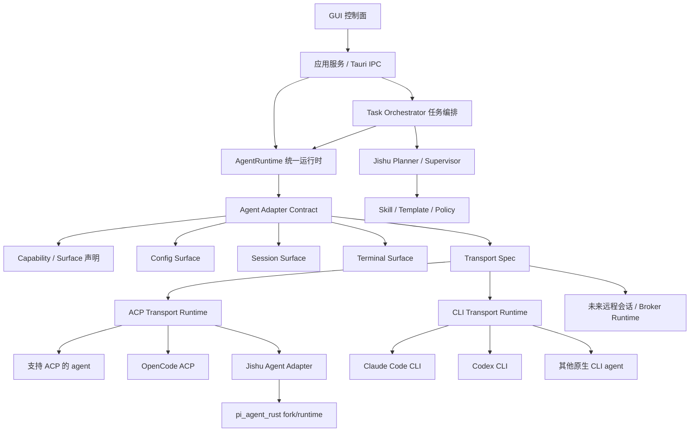

# Jishu Hub 开发指导文档

本文档是 `jishu-hub` 后续开发的最高层级工程指导。新的需求、重构、缺陷修复、架构升级都必须先对照本文档判断归属层级，再进入实现。若代码、历史文档、临时方案与本文档冲突，以本文档为准，并同步修正文档或提交架构变更说明。

当前版本方向：v0.6.x 是多智能体 GUI 控制系统和 Jishu Agent 能力的探索与重建阶段，不承担旧实验逻辑兼容包袱。发现结构不合理时，优先做正确架构，而不是保留临时路径。

## 1. 系统定位

`jishu-hub` 是一个多智能体 GUI 控制系统。它不是某个单一 agent 的外壳，也不是把所有 agent 包成同一个命令的脚本集合。

核心目标：

1. 通过 GUI 管理多个智能体的配置、会话、任务、运行状态、工具事件和人工审批。
2. 通过统一运行时对接多种 agent transport，其中 ACP 优先，CLI 作为 fallback 或原生交互入口。
3. 系统内置 `jishu agent`，它既是普通可对话 agent，也是任务规划、任务调度、职责分配、过程监督和返工决策的智能中枢。
4. 所有 agent 对 GUI 表现为统一能力模型，但每个 agent 的命令、配置、会话、事件格式由自己的 adapter 负责。

一句话架构：

```text
Jishu Hub = GUI 控制面 + AgentRuntime + Agent Adapter Contract + 通用 ACP/CLI Transport + Jishu Planner/Supervisor
```

## 2. 总体分层



分层职责：

| 层级 | 职责 | 禁止事项 |
| --- | --- | --- |
| GUI 控制面 | 渲染页面、交互、状态展示、人工审批输入 | 不拼 agent 命令，不解析 agent 私有配置/会话 |
| 应用服务 / IPC | 接收 GUI 请求，调用领域服务，做参数校验 | 不写 `activeId === "xxx"` 业务分支 |
| AgentRuntime | 选择 transport，管理进程、ACP 会话、取消、事件流、完成状态 | 不承载某个 agent 私有业务 |
| Agent Adapter | 声明能力与 surface，生成原生命令，解析私有配置/会话，归一化事件 | 不承载 GUI 页面逻辑，不做任务规划 |
| ACP Transport Runtime | 通用 ACP client，实现握手、session、prompt、update、resume、取消 | 不写成 `jishu-self` 专属逻辑 |
| CLI Transport Runtime | 执行原生 CLI 命令，读取 stdout/stderr/stdin，交给 adapter normalizer | 不把所有 agent 强制包进 Jishu 命令 |
| Jishu Planner/Supervisor | 任务规划、角色分配、执行监督、返工判断、技能模板调度 | 不取代 agent adapter 层 |
| Pi runtime fork | 提供 Jishu Agent 的底层 agent loop、工具、会话能力 | 不散落复制到 Hub 主代码 |

## 3. ACP 是一等通用 transport

ACP 必须在架构中独立存在。它不是 `jishu-self` 的私有实现，也不是适配某个 agent 的特例。

正确模型：

```text
Agent Adapter -> AcpCommandSpec -> AgentRuntime -> ACP Transport Runtime -> 目标 agent ACP server
```

约束：

1. `ACP Transport Runtime` 负责通用协议交互：`initialize`、`session/new`、`session/resume`、`session/load`、`session/prompt`、`session/update`、完成事件、错误事件、usage、取消和 session id 解析。
2. 每个支持 ACP 的 agent 只通过 adapter 声明 `TransportSurface::AcpPreferred`，并实现 `build_acp_command(ChatRequest) -> AcpCommandSpec`。
3. `AcpCommandSpec` 只描述要启动哪个 ACP server，包括 program、args、envs。它不应包含 GUI 业务，也不应包含 Jishu 任务编排语义。
4. `jishu-self`、OpenCode、未来 Claude ACP、远程 ACP agent 都应复用同一个 ACP runtime。
5. 任何新增 ACP agent 都不能复制 `jishu-self` 的 ACP loop，也不能在页面或 IPC 中直接写 JSON-RPC 帧。
6. ACP 事件必须统一归一化成 `NormalizedEvent`，由 GUI 和 Task Orchestrator 共同消费。

当前实现锚点：

- `src-tauri/src/agent_runtime.rs`：统一选择 ACP/CLI transport。其中的 `run_acp_turn_blocking` 等阻塞执行路径必须调用 `acp_runtime.rs` 提供的底层纯函数（如 `write_jsonrpc_request`），严禁重复实现 JSON-RPC 解析封装逻辑。
- `src-tauri/src/acp_runtime.rs`：GUI 长会话 ACP client runtime（也是 ACP 底层通信解析函数的唯一信任源）。
- `src-tauri/src/agent/mod.rs`：`AcpCommandSpec` 和 agent surface 状态。
- `src-tauri/src/agent/traits.rs`：`build_acp_command` adapter contract。
- `src-tauri/src/agent/jishu_self/mod.rs`：Jishu Agent 只是一个 ACP adapter 实例。
- `src-tauri/src/agent/adapters/opencode.rs`：OpenCode ACP adapter 实例。

## 4. CLI 是原生入口，不是通用包裹层

CLI transport 用于两类场景：

1. agent 本身只有 CLI 交互面，例如 Codex、Claude Code 的当前默认模式。
2. 用户主动打开终端，使用该 agent 的正式命令进行交互或恢复会话。

原则：

- 用户可见命令必须是正式命令，例如 `jishu chat start --agent jishu-self --project .`、`jishu chat resume <session-id>`、`claude --resume`、`codex ...`。
- GUI 的“跳转控制台”只能调用 adapter 的 terminal surface，不允许页面拼接命令。
- Jishu Agent 对外就是 `jishu xxx`。底层是否复用 Pi、是否通过 ACP、是否设置 env，都是 adapter/runtime 内部职责。
- 不允许把外部 agent 统一包装成 `jishu agent-bridge`。当前正式路线已经移除临时 bridge/RPC 主路径。

## 5. Adapter 是硬边界

所有涉及智能体差异的逻辑必须由 adapter contract 或 adapter 之上的统一应用服务表达。

必须由 adapter 或 adapter surface 提供的能力（具体通过 `TerminalAdapter`、`TransportAdapter`、`ConfigAdapter`、`AgentManifest` 四大核心 Trait 承载）：

- agent 基础信息、健康检查、安装提示（含 `install_package_manager` 和 `auto_installed` 等标识）、动态 Logo 路径（`logo_path`）。
- transport 声明：ACP 优先、CLI、Embedded、未来 Remote。
- 配置 surface：raw、structured、model-store、unsupported。
- 项目设置 surface。
- 会话列表、会话恢复、消息解析、project path 编码转换。
- 终端启动/恢复命令。
- 流式事件归一化。
- 权限、工具、审批能力声明。

禁止：

- 禁止在 GUI、IPC、配置页、聊天页、任务页写 `activeId === "jishu-self"`、`agentId === "codex"` 这类业务分支。
- 如果现有 contract 无法表达差异，必须先扩展 capability 或 surface，再实现功能。
- 禁止为了快速修复把某个 agent 的配置解析、会话路径、终端命令写进页面组件。

例外处理：

- 调试脚本、迁移脚本可以短期识别具体 agent id，但不得进入生产运行路径。
- 若确实需要 agent id 参与数据迁移，必须在代码注释和文档中标明迁移范围、删除条件和目标 contract。正常功能实现不能以 agent id 分支作为方案。

## 6. Jishu Agent 的边界

`jishu-self` 是系统内置 agent，必须同时满足两种身份：

1. 普通 agent：可在智能体列表中选择，可聊天、可配置、可查看会话、可跳转终端。
2. 任务智能中枢：在任务维度负责规划、分解、选择 skill/template、分派其他 agent、监督执行、触发人工干预、判断返工和收敛。

边界：

- Jishu Agent 不是 Hub 的通用适配层。
- Jishu Agent 不负责替其他 agent 解析配置、生成终端命令、读取会话文件。
- Jishu Agent 的任务调度能力通过 Task Orchestrator 和 Planner/Supervisor 使用。
- Jishu Agent 的底层 agent loop 当前复用 `pi_agent_rust` fork，但 GUI 和用户不应看到 Pi 身份。

当前 Jishu Agent runtime 约束：

- 使用 `pi_agent_rust` 作为 fork/runtime，后续通过 Git 同步上游。
- 由 `JishuSelfAgent` adapter 生成 ACP command。
- 通过 `PI_CODING_AGENT_DIR=~/.jishu-agent` 隔离 Jishu 自有 runtime 数据。
- 通过 identity prompt 明确对用户呈现为 `jishu agent`，不是 Pi。
- 会话保存走 Pi session 机制，Hub 保存 GUI session 与 native session 的映射。
- 不再使用临时 JSON-RPC/RPC bridge 作为 GUI 对话主路径。

## 7. 配置系统

配置页必须由 adapter 的 `ConfigSurface` 驱动。

推荐 surface：

- `Raw { format }`：适合 Codex 这类原生配置文件。
- `Structured { schema_id }`：适合 Claude/OpenCode 等可结构化编辑的 agent。
- `ModelStore { provider, supports_picker }`：适合 Jishu/Pi 模型库。前端必须严格依赖 `supports_picker` 来决定是否渲染模型选择器，绝对禁止前端写 `activeId === "pi"` 这类的嗅探逻辑。
- `Unsupported { reason }`：明确不可配置。

规则：

1. 配置加载、保存、校验都要通过后端 adapter/配置服务。
2. 前端只根据 surface 渲染对应编辑器。
3. 新增 agent 配置时，先定义 schema 或 model-store contract，再接页面。
4. 配置错误要返回结构化错误，页面只负责展示，不解析 agent 私有文件。

## 8. 会话系统

会话是 agent 私有数据，Hub 只持有统一索引和展示模型。

规则：

- adapter 负责真实 session id、文件路径、project path 编码、消息结构解析。
- AgentRuntime 负责 GUI 临时 session id 与 native session id 的解析、过滤和替换。
- `pending-*`、`new_session_*` 这类 GUI 临时 id 不能传给 native agent resume。
- ACP agent 应通过 `session/resume` 或 `session/load` 恢复 native session。
- CLI agent 应通过 adapter 生成原生命令恢复。
- 消息展示统一转换到 Hub 的 message/content block 模型。

Jishu/Pi 会话特别约束：

- Pi 的项目路径编码必须使用 Pi 兼容规则。
- `jishu-self` 恢复会话时要找到 native Pi session，而不是拿 GUI 临时 id 恢复。
- 对话历史保存失败时，优先检查 ACP session result、Pi session root、native session id 映射。

## 9. 任务规划与 skill/template

任务能力是 v0.6.x 的核心，不是临时功能。

任务流程：

1. 用户发起任务。
2. Jishu Planner 根据目标、项目、已选 skill/template、可用 agent、权限策略生成 plan。
3. GUI 展示 plan，支持交互修改、补充约束、重新规划、最终确认。
4. Task Orchestrator 执行 plan。
5. 每个 step 通过 AgentRuntime 派发到目标 agent。
6. GUI 展示每个 agent 的执行状态、工具事件、输出、错误、审批请求。
7. Jishu Supervisor 汇总结果，判断是否返工、继续、停止或请求人工决策。

skill/template 规则：

- `superpowers`、`gstack`、其他 task template 都应作为声明式能力输入，影响规划和执行策略。
- skill 选择不能只停留在 UI 标签，必须进入 plan document 和 run trace。
- 不同 skill 的目标效果要可测试：plan 是否体现方法论、执行是否按模板拆分、结果是否展示。
- 新增 skill 时，应先定义输入、适用场景、预期 plan 结构、验收方式。

## 10. 权限与人工干预

权限不是 adapter 私有判断，也不是 GUI 文案。

目标层次：

- Adapter 声明 agent 支持哪些权限能力和工具事件。
- AgentRuntime/Transport Runtime 捕获工具调用、文件写入、命令执行、网络访问等事件。
- Permission Policy 判断是否允许、拒绝、请求人工确认。
- GUI 只展示审批请求并把用户决策回传。
- Task Orchestrator 根据审批结果继续、暂停、返工或失败。

ACP 场景下，审批应优先通过 ACP 的 tool/update/approval 能力表达。若某个 agent 暂不支持执行前拦截，必须在能力声明中体现，不能假装已经完整支持。

## 11. 版本与验证纪律

每次交付给用户测试前都要递增版本号，便于用户确认是否安装了最新构建。当前测试版为 `0.6.14`。用户最终确认后，再按发布要求改为正式 `v0.6.0`。

修改范围涉及 agent、adapter、ACP、任务编排、配置页时，至少执行：

```powershell
cargo fmt --manifest-path src-tauri\Cargo.toml
cargo check --manifest-path src-tauri\Cargo.toml
cargo test --manifest-path src-tauri\Cargo.toml runtime_transport_uses_adapter_contract_not_bridge_wrapping
cargo test --manifest-path src-tauri\Cargo.toml registry_exposes_adapter_surfaces_without_agent_id_branching
cargo test --manifest-path src-tauri\Cargo.toml jishu_interactive_invocation_uses_pi_without_bridge_or_json_mode
```

若改动 `third_party/pi_agent_rust` 的 ACP/session/model/tools：

```powershell
cargo fmt --manifest-path third_party\pi_agent_rust\Cargo.toml
cargo test --manifest-path third_party\pi_agent_rust\Cargo.toml acp --lib
```

用户主要做 GUI 功能验证，开发者负责打包、基础命令检查、Rust/前端构建检查和测试文档。

## 12. 文档维护规则

以下场景必须更新本文档：

1. 新增或调整 AgentRuntime、adapter contract、transport surface。
2. 新增 agent 接入方式，例如远程 ACP、WebSocket broker、云端 agent、daemon。
3. 新增大的任务编排能力，例如 Harmes 自学习架构、远程调度会话能力、跨机器执行。
4. 新增影响权限、审批、工具调用、模型路由、session broker 的能力。
5. 推翻某个临时实现或移除历史设计。
6. 前端文案变动时：所有涉及用户感知的文案与状态文本，禁止包含具体引擎的代号（如 Pi、jishu-self 等），必须全部接入 i18n 系统并使用统一泛化名词。

每次 v0.6.x 交付还应在 `docs/v0.6.0/final-goal/codex` 下补充：

- 完成报告。
- GUI 测试步骤。
- 架构差异或问题闭环说明。
- 可能问题和后续风险。

## 13. 后续大版本预留

### Harmes 自学习架构

Harmes 或类似自学习能力应作为学习/evaluation/policy 层接入，不应塞入任意 agent adapter。

原则：

- 学习输入来自 run trace、plan document、agent result、人工反馈。
- 学习输出只能通过 policy、prompt pack、skill、planner hint、evaluation rule 影响任务。
- 不允许隐式修改 agent adapter 行为。
- 所有自学习影响必须可追踪、可回滚、可解释。

### 远程调度会话能力

远程调度应作为 Remote Runtime 或 Session Broker 层，不由某个 agent adapter 私自实现。

原则：

- 远程 agent 仍通过 adapter contract 声明能力。
- 远程调用仍输出 `NormalizedEvent`。
- 远程会话 id、权限、取消、恢复、日志必须有统一 broker contract。
- GUI 不关心本地进程、远程进程、云端任务的差异。

### 多协议扩展

未来可以支持更多 transport，但新增前必须回答：

1. 它与 ACP/CLI 的关系是什么。
2. 是否需要新的 `TransportSurface`。
3. 事件如何归一化。
4. 会话如何恢复。
5. 权限如何拦截。
6. GUI 是否无需新增 agent id 分支。

## 14. 开发决策清单

实现任何 agent 相关需求前，先回答：

1. 这是 GUI 展示问题、应用服务问题、AgentRuntime 问题、adapter 问题、transport 问题，还是 Task Orchestrator 问题。
2. 是否需要新 surface/capability，而不是写 agent id 分支。
3. 是否需要 ACP，若需要，是否复用通用 ACP runtime。
4. 是否影响配置页、会话页、终端跳转、任务执行四条路径。
5. 是否影响 Jishu Agent 的普通 agent 身份或任务中枢身份。
6. 是否需要更新 `DEVELOP_READ.MD` 和 codex 完成报告。
7. 是否需要给用户递增版本号并说明测试步骤。

## 15. 当前优先修复方向

当前架构基准已经明确：

1. ACP 已提升为通用 transport，不是 `jishu-self` 私有逻辑。
2. Jishu Agent 通过 adapter 生成 ACP command，对接 `pi_agent_rust`。
3. GUI chat、task dispatch、CLI send 都应通过 AgentRuntime 选择 transport。
4. 配置页、会话页、终端跳转必须通过 adapter surface。
5. 临时 RPC/bridge 主路径已经不再作为正式方向。
6. 后续若发现旧代码仍绕过 adapter contract，应直接按本文档重构，不为兼容旧实验路径让步。
