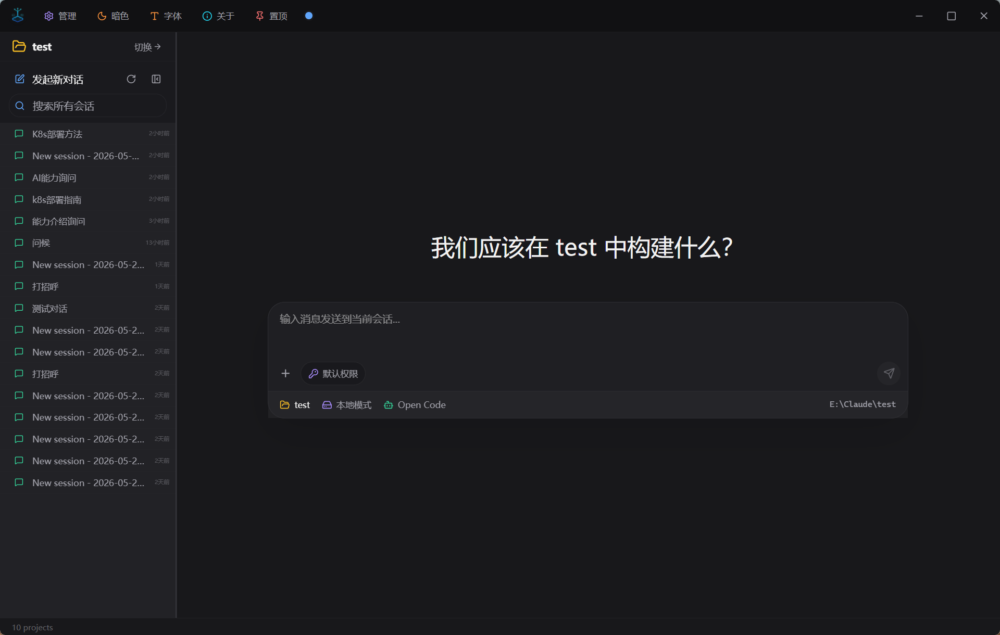
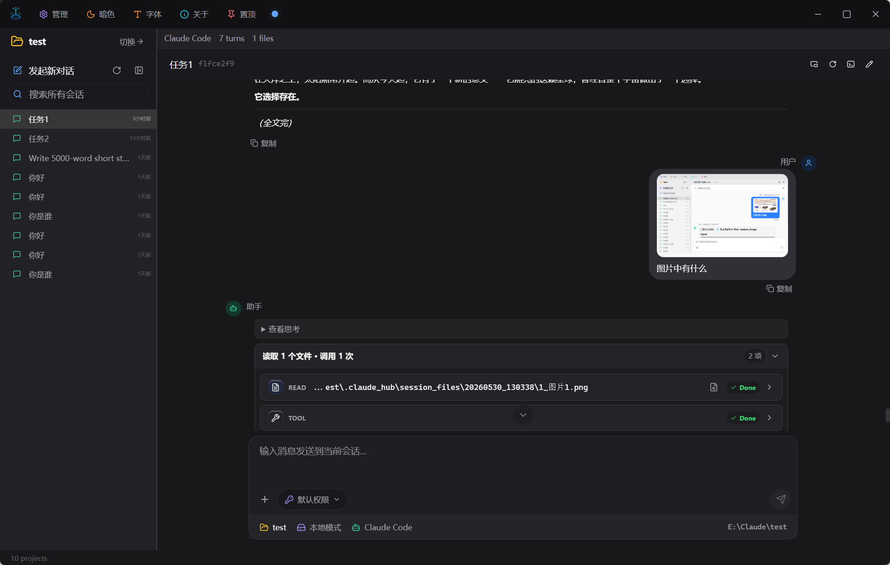
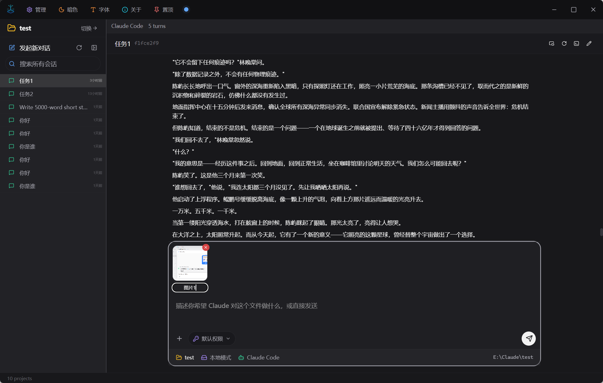
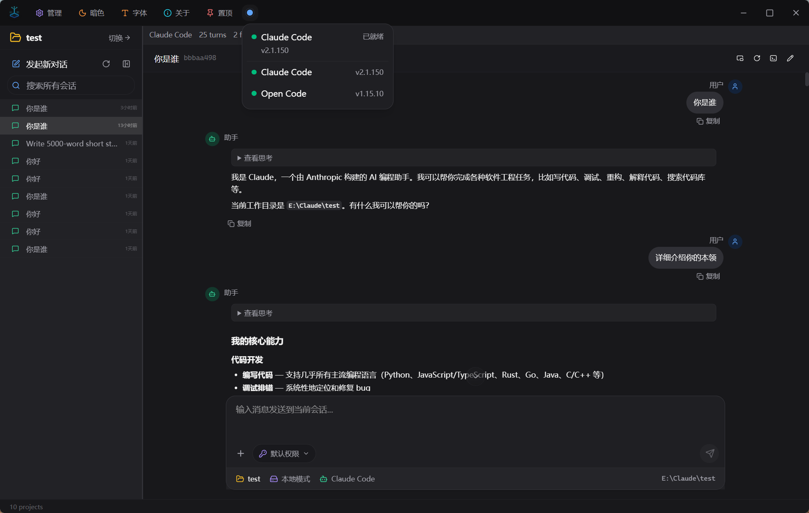
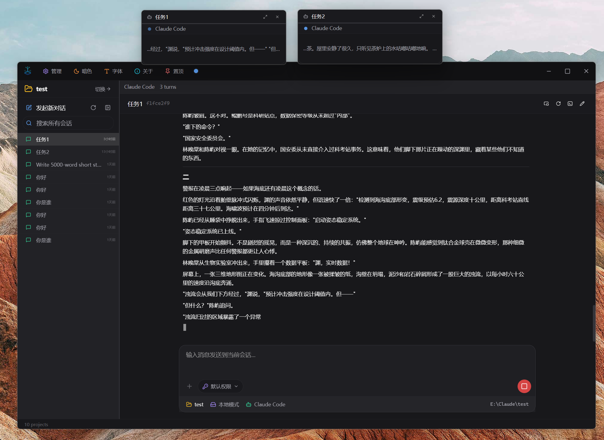
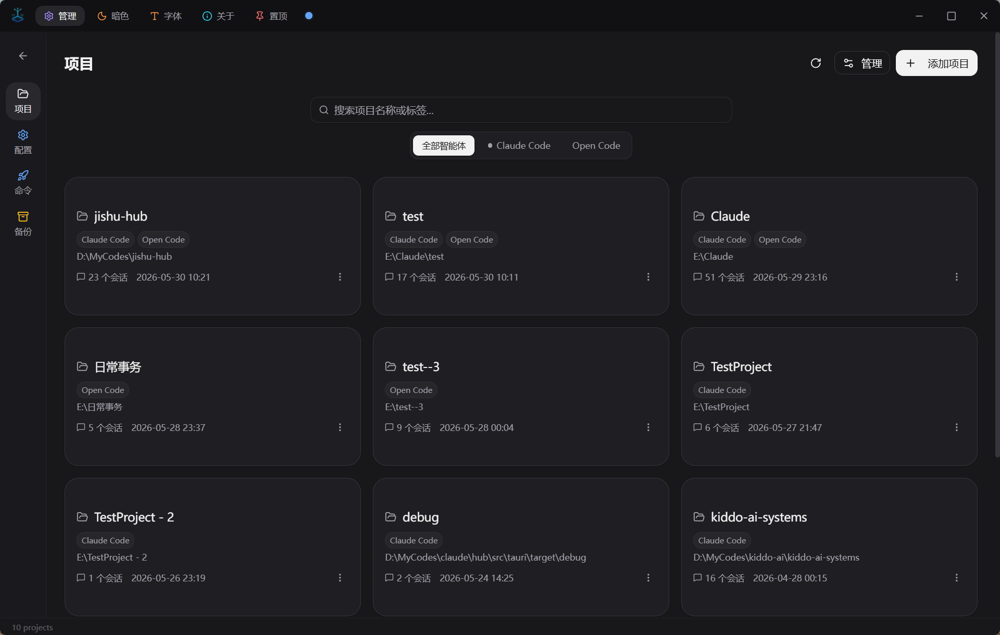
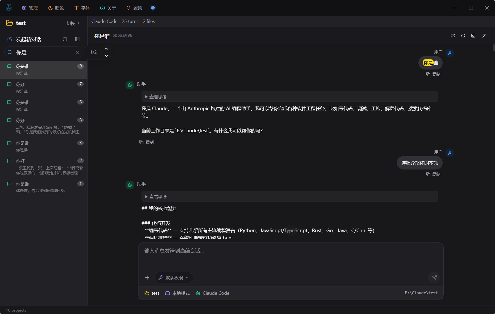
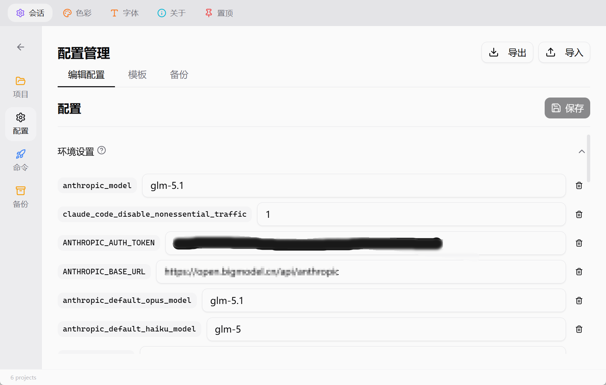

<div align="center">

# Jishu Hub（机枢）

### 基于 CLI 技术的多智能体协同平台

[](https://gitee.com/wangzwa/jishu-hub/releases)
[](https://gitee.com/wangzwa/jishu-hub/releases)
[](https://github.com/wang5766171/jishu-hub/releases/latest)
[](https://tauri.app/)

[English](README.md) | [中文](#)

镜像：[Gitee](https://gitee.com/wangzwa/jishu-hub) | [GitHub](https://github.com/wang5766171/jishu-hub)

</div>

## 为什么选择 Jishu Hub？

AI 编程智能体正在快速演进 —— Claude Code、OpenAI Codex、Open Code 等强大的 CLI 工具不断涌现，但管理它们却很零散：终端窗口到处都是、会话日志深埋文件中、配置需要手动编辑 JSON。

**Jishu Hub（机枢）** 是一个多智能体协同平台，将各种基于 CLI 的 AI 智能体统一到同一个桌面界面中。就像一台精密机器中的齿轮 —— 每个智能体就是一个"机枢"，在平台上稳定、智能地协作运行。

> **零开销 · 零风险 · 零臃肿**
>
> - **原生 CLI 对接** — 直接连接已有的智能体命令行，无需代理、无需包装，零额外性能消耗
> - **极速启动，极小体量** — 基于 Tauri v2 + Rust 构建，安装包不到 10 MB，冷启动不到 1 秒
> - **极致数据安全** — 会话历史保存在各项目目录下；软件元数据存储在本地 `~/.jishu-hub/`；任何数据都不会上传

## 快速开始

前往 [Gitee Releases](https://gitee.com/wangzwa/jishu-hub/releases) 下载最新版本安装包。

也可以从 [GitHub Releases](https://github.com/wang5766171/jishu-hub/releases/latest) 下载。

**系统要求**：Windows 10 及以上

## 界面预览

### 主对话界面
<p align="center">
  
</p>
体验原生桌面上干净、专注且沉浸式的对话界面。Jishu Hub 用精心设计的暗色模式工作区取代了凌乱的终端窗口。

### 多模态交互
<p align="center">
  
  
</p>
支持丰富的多模态对话。轻松发送图片和文件，并使用内置的图片标注工具，准确地向 AI 传达你的焦点。

### 多智能体与并行任务处理
<p align="center">
  
  
</p>
通过插件架构，在不同的 CLI 智能体（Claude Code、OpenAI Codex、Open Code 等）之间丝滑切换。支持跨项目并行运行多个对话，上下文互不干扰。

### 项目与会话管理
<p align="center">
  
  
</p>
自动发现和整理你的项目。利用强大的全局会话搜索功能，瞬间定位过去的重要对话历史。

### 配置管理
<p align="center">
  
</p>
告别手动修改 JSON 的烦恼。使用可视化的表单编辑器管理模型、环境变量和智能体预设，内置主流供应商模板，支持自动备份与恢复。

## 功能特性

### 多智能体平台
- 插件化智能体注册与一键切换
- 目前支持 **Claude Code**、**OpenAI Codex**、**Open Code**
- AgentPlugin trait 抽象层，可轻松接入新智能体
- 内置环境检测与智能体一键安装（npm / winget / choco）

### 应用内对话
- 无需打开终端，直接在 Hub 内与 AI 智能体对话
- 支持发送任意格式文件附件（图片、文档、代码等）
- 项目内文件自动识别，直接引用路径不重复复制
- 支持粘贴、拖拽、文件选择器三种方式添加附件
- 流式输出 + Markdown 实时渲染
- 悬浮窗口（画中画），会话独立显示

### 会话管理
- 按项目分组浏览所有会话
- 会话内容全文搜索，快速定位历史对话
- 自定义会话名称，方便管理
- 会话可一键在终端中继续

### 项目管理
- 自动发现所有智能体下的项目
- 显示会话数、最后活跃时间
- 通过文件夹选择器添加项目（含未初始化项目）

### 配置管理
- 可视化表单编辑智能体配置
- 模型选择、环境变量、插件开关
- 内置主流供应商模板（OpenRouter、硅基流动等），一键配置
- 配置预设保存与一键切换
- 自动备份 + 一键恢复历史版本

### 自定义命令
- 创建和管理自定义斜杠命令
- 直接在界面中执行

### 个性化
- 三种主题：浅色 / 色彩 / 暗色（默认暗色）
- 系统界面和会话内容字体独立调节（四档预设）
- 中英文双语支持，自动识别系统语言

## 贡献

欢迎贡献代码、报告问题或提出建议！

1. Fork 本仓库
2. 创建特性分支 (`git checkout -b feature/amazing-feature`)
3. 提交更改 (`git commit -m 'Add amazing feature'`)
4. 推送到分支 (`git push origin feature/amazing-feature`)
5. 发起 Pull Request

<details>
<summary><strong>本地开发</strong></summary>

### 环境要求

| 软件 | 最低版本 | 用途 |
|------|----------|------|
| [Node.js](https://nodejs.org/) | 18+ | 前端构建 |
| [Rust](https://rustup.rs/) | 1.77+ | 后端编译 |
| [VS Build Tools 2022](https://visualstudio.microsoft.com/visual-cpp-build-tools/) | 最新 | Windows C++ 工具链 |

### 构建运行

```bash
git clone https://github.com/wang5766171/jishu-hub.git
cd jishu-hub
npm install
npm run tauri dev
```

</details>

<details>
<summary><strong>技术架构</strong></summary>

| 层 | 技术 |
|----|------|
| 桌面框架 | [Tauri v2](https://v2.tauri.app/) |
| 前端 | [React 19](https://react.dev/) + [TypeScript](https://www.typescriptlang.org/) |
| UI | [shadcn/ui](https://ui.shadcn.com/) + [Tailwind CSS v4](https://tailwindcss.com/) |
| 后端 | [Rust](https://www.rust-lang.org/) |
| 国际化 | [i18next](https://www.i18next.com/) |

</details>

<details>
<summary><strong>数据存储</strong></summary>

| 路径 | 说明 |
|------|------|
| `~/.jishu-hub/` | Hub 元数据（智能体注册、会话名称、预设、状态） |
| `~/.claude/` | Claude Code 智能体数据 |
| `~/.codex/` | Codex 智能体数据 |

</details>

## License

[MIT](LICENSE) © 2025 Jishu Hub
